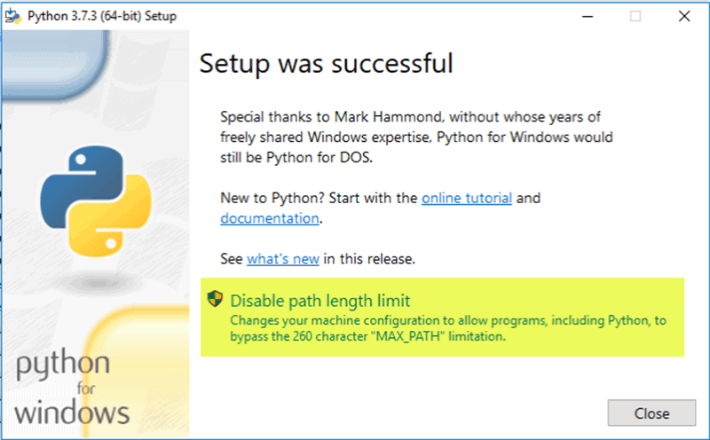

###### [Python API CLient of Petro-Logisitics](../README.md) > Windows Instructions
# Windows Instructions
---

## Index
- [Install](#install)
- [Use](#use)

## Install
1. Download and install latest version of [`Python 3`](https://www.python.org/downloads/) for Windows (`PIP 3` is already included in this installation)
   - Execute downloaded installation file
   - Check `Install launcher for all users (recomended)` and `Add Python X.X to PATH` and after that click `Install Now` (In yellow on the image below)

     

   - After succesfully installed, click on `Disable path length limit` (In yellow on the image below)

     

2. Download and install latest version of [`Git`](https://git-scm.com/download/win) for Windows
3. Open a command prompt in Windows
3. Install `Pandas`
    ```cmd
    pip install pandas
    ```
4. Install `Python API CLient of Petro-Logisitics`
    - With PIP 3
      ```cmd
      pip install git+https://github.com/Petro-Logistics/petro-api-python
      ```
    - Manually
      ```cmd
      git clone https://github.com/Petro-Logistics/petro-api-python.git
      cd petro-api-python
      python setup.py install
      ```

## Use
1. Download one of the following examples:
    - [Simple Example](https://github.com/Petro-Logistics/petro-api-python/blob/master/examples/test_example.py)
    - [Pandas Example](https://github.com/Petro-Logistics/petro-api-python/blob/master/examples/test_example_pandas.py)
2. Go to the downloaded file path
    ```cmd
    cd path/to/downloaded/file
    ```
3. Execute the example without making modification
    ```cmd
    python test_example.py
    ```
     or/and
    ```cmd
    python test_example_pandas.py
    ```
4. Create a copy of the required example, renaming it
    ```cmd
    cp test_example.py your_file_name.py
    ```
     or/and
    ```cmd
    cp test_example_pandas.py your_file_name.py
    ```
5. Edit `your_file_name.py` and replace **`PLAPIClient`** example parameters with your required personal parameters
    - Initialized with 5 parameters:
      ```python
      plapiclient = PLAPIClient(
        api_url="https://secure.petro-logistics.com/api/v2/requested_report_type",
        api_key="your_api_key",
        api_hash="your_api_hash",
        http_user="your_http_user",
        http_pass="your_http_password"
      )
      ```
    - Called with 1 parameter:
      ```python
      result = plapiclient.execute("your_query_name")

      ```
6. Execute your copied file
    ```bash
    python your_file_name.py
    ```
